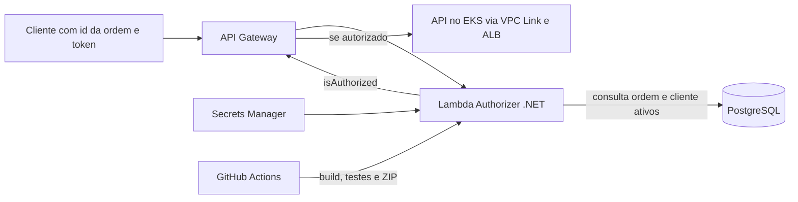

# FIAP Tech Challenge - Serverless

## OrdemServicoAuthorizer

Lambda Authorizer para o HTTP API Gateway. A funcao valida o token SHA-256
recebido no query parameter `token`. O token e formado pelo CPF normalizado do
cliente concatenado ao codigo de aprovacao da ordem de servico informada no path
parameter `id`.

A consulta usa um `DbContext` minimo do Entity Framework, isolado da aplicacao
principal, com apenas as entidades de leitura de cliente e ordem de servico. O
CPF tambem e representado por um value object local e nao ha referencias para os
projetos ou pacotes internos da aplicacao.

### Contrato de entrada

O authorizer utiliza o payload `2.0` do API Gateway:

```json
{
  "queryStringParameters": {
    "token": "d80e8c958d265c7455badf562f4cbd7914a38bda2698edb1cff74357e9bbc2d6"
  },
  "pathParameters": {
    "id": "9be8b471-bd51-4f44-a0e0-3db12cb342c3"
  }
}
```

Uma requisicao autorizada retorna:

```json
{
  "isAuthorized": true,
  "context": {
    "ordemServicoId": "9be8b471-bd51-4f44-a0e0-3db12cb342c3"
  }
}
```

Token invalido, OS invalida, OS inexistente ou pertencente a outro CPF retornam
`isAuthorized: false`, sem expor qual validacao falhou.

### Configuracao

Em ambiente AWS, configure `DATABASE_SECRET_ID` com o nome ou ARN do segredo. O
JSON armazenado no Secrets Manager deve conter a chave
`ConnectionStrings__DefaultConnection`.

Para desenvolvimento local, a variavel `ConnectionStrings__DefaultConnection`
pode ser informada diretamente e tem precedencia sobre o Secrets Manager.

### Compilar e testar

```powershell
dotnet build FiapTechChallengeServerless.slnx
dotnet test FiapTechChallengeServerless.slnx
```

### Empacotar

Com a ferramenta `Amazon.Lambda.Tools` instalada:

```powershell
dotnet lambda package `
  --project-location src/FIAP.TechChallenge.Serverless.OrdemServicoAuthorizer `
  --output-package artifacts/ordem-servico-authorizer.zip
```

O handler configurado e:

```text
Ftc.Authorizer::FIAP.TechChallenge.Serverless.OrdemServicoAuthorizer.Function::FunctionHandler
```

## Infraestrutura AWS

O Terraform e seu estado ficam no repositorio `fiap-tech-challenge-infra`, no
estagio `infra/serverless`. O repositorio de infraestrutura provisiona:

- Lambda .NET 10 nas subnets privadas;
- role de execucao e acesso somente ao segredo do banco;
- security groups para PostgreSQL e Secrets Manager;
- endpoint VPC privado do Secrets Manager;
- Lambda Authorizer HTTP API v2 sem cache;
- rotas de acompanhamento, aprovacao e cancelamento protegidas pelo query
  parameter `token`.

Antes do primeiro deploy, aplique os estados `aws-resources`, `database` e
`api-gateway`, seguidos do estado `serverless`. Este repositorio nao executa
Terraform: ele apenas compila, testa e atualiza o codigo da funcao ja existente.

Para deploy local:

```powershell
dotnet test FiapTechChallengeServerless.slnx --configuration Release

dotnet publish `
  src/FIAP.TechChallenge.Serverless.OrdemServicoAuthorizer/FIAP.TechChallenge.Serverless.OrdemServicoAuthorizer.csproj `
  --configuration Release `
  --output artifacts/publish

Compress-Archive `
  -Path artifacts/publish/* `
  -DestinationPath artifacts/ordem-servico-authorizer.zip `
  -Force

aws lambda update-function-code `
  --function-name fiap-ordem-servico-authorizer `
  --zip-file fileb://artifacts/ordem-servico-authorizer.zip
```

No GitHub Actions, configure `AUTH_ACTION_ROLE` com o ARN da role
`fiap-role-github-actions-auth`. Essa role permite consultar a funcao, atualizar
seu codigo e publicar versoes. Aplique primeiro o estagio `bootstrap` do
repositorio de infraestrutura para conceder `lambda:PublishVersion`.
O workflow de inicializacao ja executa esse estagio antes do deploy do codigo.

O deploy aguarda a atualizacao do codigo e publica uma versao com o mesmo
`CodeSha256` retornado pelo upload. Isso automatiza a publicacao antes feita no
console. O Gateway continua usando o ARN sem qualificador (`$LATEST`); publicar
uma versao nao troca o destino do authorizer nem comprova a causa de erros de
autorizacao ou timeout. O Terraform administra a infraestrutura e as permissoes;
nao deve publicar seu pacote bootstrap como se fosse o codigo da aplicacao.


## Tecnologias e arquitetura

.NET 10, AWS Lambda, API Gateway HTTP API v2, EF Core/Npgsql, Secrets Manager e GitHub Actions/OIDC. A publicação é em ZIP; Dockerfile não se aplica ao empacotamento atual.



A função não é um servidor HTTP autônomo: localmente, execute os testes acima, que exercitam o contrato do evento. O contrato de entrada e saída do authorizer está neste README. As APIs consumidoras oferecem [OpenAPI local](http://localhost:8080/openapi/v1.json) e [Scalar local](http://localhost:8080/scalar/v1) com a aplicação em Development.

## Escopo alinhado da Lambda

Conforme o alinhamento do projeto, a Lambda valida as requisições de clientes às rotas de acompanhamento, aprovação e cancelamento. Ela recebe o identificador da ordem e o token SHA-256, consulta ordem e cliente ativos, valida o CPF armazenado e compara o token com o valor esperado.

A função retorna `isAuthorized` para o API Gateway permitir ou negar o encaminhamento à API, sem cache de autorização. O JWT administrativo é emitido pela aplicação principal com login e senha. Consulte os [diagramas de sequência](https://github.com/Maieru/fiap-tech-challenge/blob/main/docs/arquitetura/sequencias.md).

O workflow atual faz build, testes e deploy, mas é disparado manualmente ou por outro workflow. Deploy automático de homologação/produção e regras de proteção de branches ainda precisam ser implementados ou comprovados.
